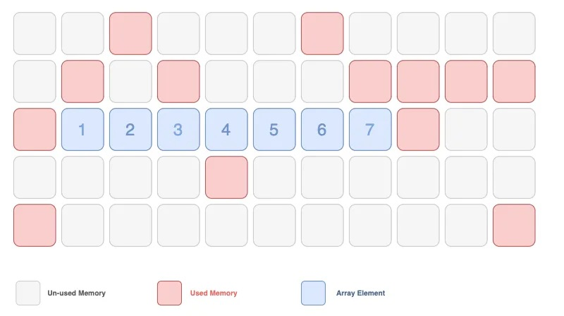
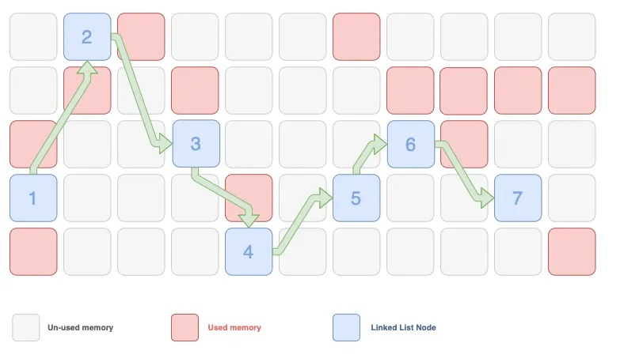
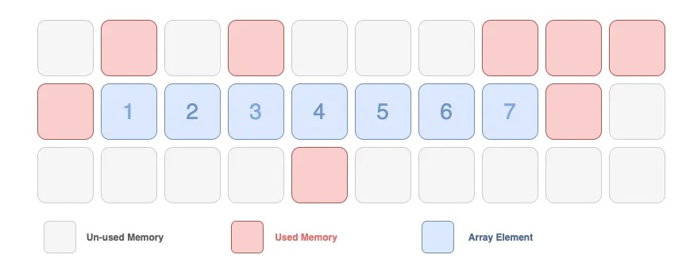
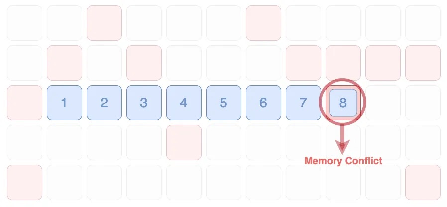
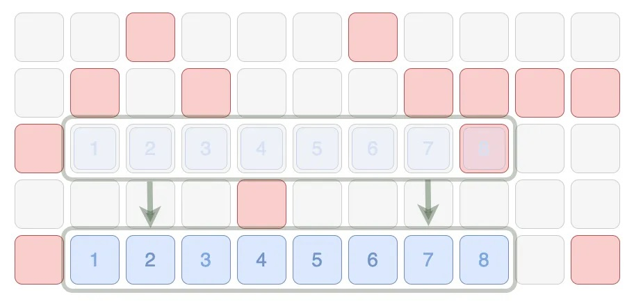

# Linked List

## Разница между массивом и однонаправленным связным списком
**Массив**:
* Время доступа к элементу: O(1)
* Время вставки в конец: O(1)
* Время вставки в начало или середину: O(n)
* Время удаления: O(n)
* Память: выделяется непрерывный блок памяти для всех элементов, размер массива фиксирован при создании.

**Однонаправленный связный список**:
* Время доступа к элементу: O(n)
* Время вставки в начало и конец: O(1)
* Время вставки в конец: O(n)
* Время удаления: O(1) при удалении первого элемента, O(n) при удалении элемента из середины списка
* Память: выделяется отдельный блок памяти для каждого элемента, размер списка может меняться динамически.

## Хранение массива и связного списка в памяти
Картинки ниже взяты на сайте [levelup.gitconnected.com](levelup.gitconnected.com) из статьи [Array vs Linked List Data Structures](https://levelup.gitconnected.com/array-vs-linked-list-data-structure-c5c0ff405f16)

### Массив
   

### Связный список


### Добавление в массив


Если добавить 8 в конец массива, где следующая ячейка занята




```JS
class Node {
  constructor(value) {
    this.value = value;
    this.next = null;
  }
}
```

## Методы
### Add first
```Typescript
function addFirst(node: Node): void {}
```

___

### Add last
```Typescript
function addLst(node: Node): void {}
```

___

### Add node at index
```Typescript
function addAt(index: number, node: Node): void {}
```

___

### Remove first
```Typescript
function removeFirst(): void {}
```

___

### Remove last

```Typescript
function removeLast(): void {}
```

___

### Remove at index
```Typescript
function removeAt(index: number): void {}
```

___

### Get at index
```Typescript
function getAt(index: number): Node {}
```


## Links
* [Array vs Linked List Data Structures](https://levelup.gitconnected.com/array-vs-linked-list-data-structure-c5c0ff405f16)
